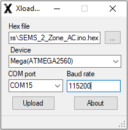
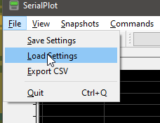
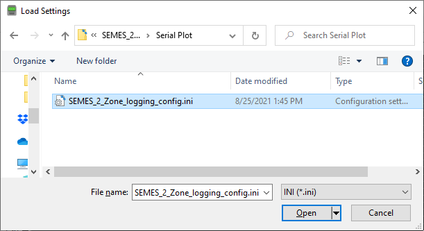
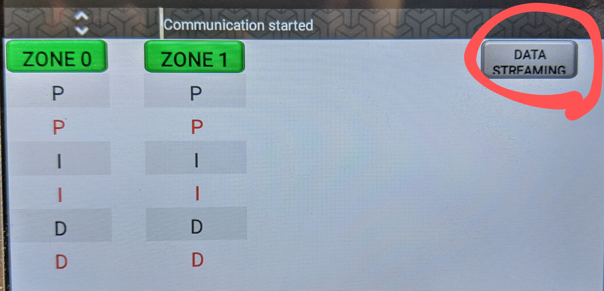
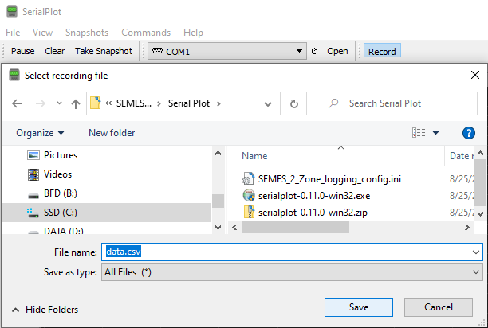

# Using This repository

First of all, *watch* and *star* this repository for all important releases. You can find those at the very top right of this page

## If you are familiar with Github:
Clone this repository as you regularly would and pull when updates are pushed to this repository to keep everything up to date.

## If you are unfamiliar with Github:
Simply click the green "code" button at the top right of the file list and download as a zip file.

Extract the zip to a location of your choosing. Upon updates, the .hex file will need to be replaced with the latest manually to avoid uploading an old version

# Binaries

Firmware for the 3rd Wave Labs Controllino controller comes in the form of a .hex binary file.

## Uploading the binary HEX file

Included within this repository is Xloader which is a third party program that is is used to upload binary HEX files to the controller.

Below are the steps to using Xloader:

### Using XLoader
Xloader has 4 main input fields: Hex file, Device, COM port, and Baud rate

Plug in the controller to the computer using the usb port on the controller.

Open the *XLoader.exe* within the XLoader folder

1. Set the *Hex file* field to the location of the provided **.hex** binary
2. Set the *Device* to: **Mega(ATMEGA2560)**
3. Set the *COM port* to the appropriate device. Should be listed in the drop down menu as COM followed by a number. 
4. Set the *Baud Rate* field to: **115200**
5. Click upload

# Data Logging

## Using serial plot

Under the [Serial Plot](https://github.com/3rdWaveLabs/SEMES_2_Zone_Binaries/tree/master/Serial%20Plot) folder you will find everything you need to install and use serial plot.

### Installation

Install serial plot using the [serialplot-0.11.0-win32.exe](https://github.com/3rdWaveLabs/SEMES_2_Zone_Binaries/blob/master/Serial%20Plot/serialplot-0.11.0-win32.exe)

### Setup and Use

After installing Serial Plot, load the proper settings from [SEMES_2_Zone_logging_config.ini](https://github.com/3rdWaveLabs/SEMES_2_Zone_Binaries/blob/master/Serial%20Plot/SEMES_2_Zone_logging_config.ini)

After loading the settings file, you should see the correctly labeled fields under the plot tab at the bottom and at the bottom right of the plot window.

Connect your pc to the USB port on the front of the control box and from the HMI enable serial streaming

Select the listing with the name containing **arduino** and click *open*
If you don't see it listed, click the refresh button next to open.

Upon connecting, you will hear the controller restart. This is normal behavior. After a few seconds the data will start showing in the plot window.

**Streaming from the controller can be enabled on the "Control Tuning" page of the HMI.**

**Streaming should be disabled durring normal operation, as it slows loop time.**

## Recording Data

To record data in serial plot for later analyization, click the record button and give the file a name with the file type ".csv"

Clicking the record button again saves the file and stops writing.